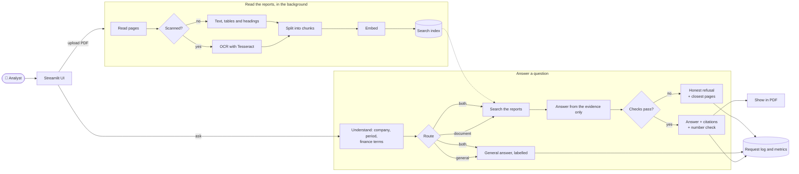

<div align="center">

# 📊 DocQA

### A research agent for financial analysts, built on company reports.

Load a company's annual reports. Ask what an analyst would ask. Get a cited, checked answer, or an honest *"the reports don't say."*


</div>

---

## 🎯 What we are building

An equity or credit analyst covering a company spends hours in its annual reports: 300 to 450 pages each, one per year, full of tables that look almost identical from year to year. Finding a figure, checking it against last year, working out a margin and understanding *why* it moved means a lot of Ctrl-F and a lot of re-reading. General chatbots are faster, but they guess, and a confident wrong number is worse than no answer.

**DocQA is a financial research agent for analysts.** It reads a company's reports, works out which report and which year a question is about, finds the evidence, writes the answer from that evidence alone, checks every figure against the source, and shows the exact row on the PDF page. When the reports don't contain the answer, it says so and points to the closest pages instead of guessing.

> **Business objective:** give an analyst a correct, verifiable answer from a company's own reports in seconds instead of minutes of manual searching, and never present an unsupported figure as coming from those reports.

It is a college team project for the LLMOps course: a small, fully measured system rather than a large, unmeasured one.

---

## 🧑‍💼 What an analyst can do with it

| Ask… | Example | What DocQA does |
|---|---|---|
| 🔢 **Look up a figure** | *"What was standalone revenue from operations in FY2025?"* | Finds the statement row, quotes the figure with its unit, and cites the page. |
| 📅 **Compare years** | *"How did EBITDA margin change from FY25 to FY26?"* | Narrows the search to the right years' reports and answers from both. |
| 🧮 **Get a computed figure** | *"By how much did EBITDA grow from FY24 to FY25?"* | Works out the difference, share or growth rate, and shows which cited figures it came from. |
| 🔍 **Understand a movement** | *"Why did finance cost fall in FY26?"* | Pulls the figures and the management commentary that explains them. |
| 📖 **Learn a concept** | *"What is working capital?"* | Answers from general knowledge, clearly labelled *"not from your documents"*. |
| 🔀 **Ask both at once** | *"What was FY25 PAT, and what does PAT mean?"* | Splits the question and gives two separate, labelled answers. |
| ❓ **Ask something the reports don't say** | *"What is the FY2030 revenue forecast?"* | **Refuses to guess**, and points to the closest pages. |
| 📄 **Check the source** | Click **Show in PDF** on any citation | Opens the cited page with the answer's row shaded and the figure boxed. |

Several companies can be loaded at once. Each upload is tagged with its **company, report type and period** from the file name (e.g. `EIG AR FY25.pdf` → EIG · Annual report · FY25), and the analyst picks the company in the UI so an answer never mixes up two companies' figures.

---

## 🧠 How the agent works

Every question goes through the same sequence of decisions. Each step is plain Python with at most one LLM call, so each one can be measured, logged and debugged on its own.



### A question, step by step

1. **Understand the question.** Rules pick out the company and the period (`FY26`, `Q1 FY2026`, `FY 2024-25`, …), narrow the search to the matching reports, and add the wording the reports use (`PAT` → profit after tax, `finance cost` → finance costs). One small-model call also fixes spelling and names the company. Both sit behind the **Enhance** toggle by the chat box, on by default; with it off, the question is searched as typed, still limited to the chosen company.
2. **Route.** A small, fast model decides whether the question needs the reports, general knowledge, or both, and splits mixed questions in two. If routing fails, the question is treated as a document question, so the worst case is a refusal, never an invented fact.
3. **Search.** Keyword search and meaning-based search run together and their rankings are merged. Passages under a heading that fits the question (e.g. *Financial Highlights* for EBITDA) get a small boost, and when one piece of a split table is found, the rest of that table comes with it. The best **8 passages** go to the model.
4. **Check 1: is anything relevant?** If even the best passage is a weak match, the agent declines straight away, without an LLM call.
5. **Answer from the evidence only.** The large model sees only those passages and must answer from them. A different year or a different company does not count. If the answer is not there, it must say *insufficient*. **(Check 2.)**
6. **Check 3: are the citations real?** The model cites passages by ID, never by page number. We map each ID back to its page ourselves and drop any ID we never sent.
7. **Check the numbers.** Every figure in the answer is looked up in the cited text, with ₹, %, crore, lakh and million all handled. A figure the model **computed** (a difference, share or growth rate) passes only if it can be rebuilt exactly from cited figures. Anything else gets a visible ⚠️ warning.
8. **Show the evidence.** Citations read like *EIG AR FY26.pdf · p.32 (PDF p.34)*; **Show in PDF** renders that page with the row highlighted.
9. **Log.** One row per question in the request log: route, timings, tokens, cost and outcome, but never the question text unless that is switched on.

### What the analyst sees

| Situation | Response |
|---|---|
| Enough evidence | The answer, numbered sources, quoted snippets and **Show in PDF** |
| A computed figure | The answer plus *"Computed from cited figures: 482.06 = 1097.36 − 615.30"* |
| Not enough evidence | *"I couldn't find this in your documents. I won't guess."* plus the closest pages |
| Report still processing | The answer comes with a caution and how many pages have been searched so far |
| No report uploaded | A general answer with its label, and a note to upload a PDF |
| The LLM service is down | *"The answer service is temporarily unavailable"* plus the most relevant passages found |

---

## 🛡️ Why an analyst can trust it

- **Abstain first.** Three independent checks must pass before a document answer is shown. Otherwise the agent declines.
- **Every figure is verified.** A number must appear in the cited text, or be exactly rebuildable from cited numbers, or it is flagged.
- **Every answer is traceable.** Each claim cites a page, and one click shows the highlighted row in the original PDF.
- **No wrong-company answers.** With several companies loaded, the analyst picks one, and only that company's reports are searched.
- **Scanned reports and tables work.** Scanned pages are read with OCR. Financial tables stay tables, with their titles and header rows kept on every piece.
- **No waiting.** Reports become searchable while they are still being processed, text pages first.
- **Everything is measured.** 127 labelled questions, a regression gate in CI, and a live metrics dashboard.

## 📐 Scope

| ✅ In scope | ❌ Out of scope (on purpose) |
|---|---|
| English company reports as **PDF**, text or scanned, tables included | Word, Excel, PowerPoint and image files |
| Annual reports first; quarterly results, presentations and call transcripts are recognised from the file name | Live market data, share prices and news |
| Fact lookup, year-on-year comparison, simple computed figures, explanations from the report | Forecasts, valuations and investment recommendations |
| Several companies loaded, one company per question | Cross-company comparisons in a single answer |
| Single-turn questions | Chat memory and follow-up questions |
| A fixed, measured sequence of steps | Open-ended autonomous tool loops, LangChain, LlamaIndex, fine-tuning |
| One user, running locally or in Docker | Multiple users and logins, web search |

---

## 📈 Results so far

> Only measured numbers are shown. Anything not measured yet is listed under *Pending*.

### 🔀 Routing: which path a question takes (117 questions)

| Method | Overall accuracy | Mixed questions handled |
|---|:---:|:---:|
| Keyword rules | 95.7% | 11 / 15 |
| Retrieval-score threshold | 84.6% | 0 / 15 |
| **LLM router (ours)** | **99.2%** | **15 / 15** |

Simple rules already handle most plain questions. The LLM router earns its place on **mixed** questions, which have to be split in two, something rules cannot do.

### 🔎 Search: does the right page reach the model?

| Question set | Reports loaded | Recall@5 | MRR |
|---|---|:---:|:---:|
| 72 answerable questions | EIG FY25 | **98.6%** | **0.819** |
| Same 72 questions, enhanced search | EIG FY24 + FY25 + FY26 (near-identical tables) | 90.3% | 0.613 |
| 10 analyst "trap" questions, enhanced search | EIG FY24 + FY25 + FY26 | **100%** | **0.825** |

With two other companies' reports loaded (Fortis and HPCL, 427 and 436 pages), the passage holding the figure reached the model for **14 of 15** financial-statement questions.

<details>
<summary><b>How search got here</b></summary>

The first version scored well on a page-level metric but hid a real problem: **the actual figure was in the model's context for only 1 of 69 table questions.** Table numbers had been separated from their titles. Three changes fixed it, each measured before it was kept:

| Change | Effect |
|---|---|
| Table titles and page headings added to every chunk | A table chunk now says *"Standalone Balance Sheet … (₹ million)"* |
| Keyword search combined with meaning-based search | Exact figure in the top 5: 1 → 52 of 69 table questions |
| Finance synonyms and a small topic boost | Trap set: Recall@5 90% → 100%; the finance-cost row went from outside the top 50 to #1 |

*Caveat: the main test questions reuse the report's own wording, which favours keyword search, and the topic boost was tuned on the 10 trap questions.*

</details>

### ✍️ Answers

| Test | Result |
|---|---|
| First 21 document questions | **19 / 21 correct**, **0 wrong numbers**, every answer cited the right page. Both misses were cautious refusals |
| 10 analyst trap questions (live, before the latest search fixes) | 6 correct · 1 correct but incomplete · 1 wrong explanation · 2 refused. The search fixes since then bring both refused answers' evidence into the top 3 |

### ⚙️ Processing speed (2-core laptop)

| Report | Pages | Time to fully indexed |
|---|:---:|:---:|
| EIG FY25 (text) | 86 | **35 s** |
| Fortis FY25 (text) | 427 | **68–75 s** |
| HPCL FY25 (text) | 436 | **83 s** |
| Scanned PDF (OCR) | 20 | 4.4 s per page |

Static embeddings and parallel page parsing made indexing about 10× faster than the first version (Fortis went from ~17 min to ~70 s). OCR reads plain text well (91–99% word match) but tables less well (78%).

### 🚦 Load, latency and cost

| Measure | Value |
|---|:---:|
| Median latency, 1 user | **1.4 s** |
| p95 latency, 1 user | **3.0 s** |
| Errors at 3 and 5 concurrent users | 1 / 5 each (Groq rate limit) |
| Tokens per question | ~3,400 |
| Cost per question at paid Groq prices | **$0.00048** (free tier: $0) |

**The limit is Groq's free tier, not our code:** 8,000 tokens a minute is about 2–3 document questions a minute. The automatic Ollama backup exists for exactly this. *These were measured before the query enhancer was added; with **Enhance** on, each question makes one extra small-model call.*

### ⏳ Pending

Answer accuracy across all 127 questions · refusal precision and recall · grader-versus-human agreement · a re-run of the trap questions after the latest fixes · speed on a real scanned report · a longer load test · the final settings from the experiments.

---

## 🚀 Getting started

### Option 1: Docker (recommended)

```bash
cp .env.example .env          # add your GROQ_API_KEY
docker compose up -d --build
```

| Open | Address |
|---|---|
| The app | http://localhost:8501 |
| The API and its interactive docs | http://localhost:8000/docs |

### Option 2: Run locally

```bash
python -m venv .venv
source .venv/bin/activate                 # Windows PowerShell: .venv\Scripts\Activate.ps1
pip install -r requirements-dev.txt

export GROQ_API_KEY=your-key              # Windows PowerShell: $env:GROQ_API_KEY="your-key"
python -m uvicorn app.main:app --port 8000

# in a second terminal
streamlit run ui/app.py
```

**On Windows**, you can instead double-click `setup_windows.bat` once, then `start_api.bat` (it asks for the Groq key if it isn't set) and `start_ui.bat`.

> OCR for scanned pages needs **Tesseract**. It is already in the Docker image. On Windows it is found in its default install folder, or set `TESSERACT_CMD`. Text PDFs work without it.

### Try it in 3 minutes

1. Upload two or three years of one company's annual reports from the sidebar and watch them go from *Queued* to *Ready*.
2. Pick the company by the chat box and ask for a figure, e.g. *"What was revenue from operations in FY2025?"*
3. Click **Show in PDF** under a source to see the highlighted row.
4. Ask a comparison: *"How did EBITDA change from FY24 to FY25?"*
5. Ask *"What is working capital?"* and notice the *General knowledge* label.
6. Ask for something the reports can't contain and watch it decline.
7. Open the **Metrics** page.

### Run the tests

```bash
python -m pytest -q     # 784 tests, about 2 minutes; all LLM calls are mocked
ruff check .
```

---

## ⚙️ Configuration

All tuning settings live in one commented file, `config.yaml`. Secrets live only in environment variables.

### Environment variables

| Variable | What it is for | Required? |
|---|---|:---:|
| `GROQ_API_KEY` | Answers, routing and the question rewrite | ✅ |
| `GEMINI_API_KEY` | The grader, for evaluation only | — |
| `LLM_BACKEND` | `groq` (default) or `ollama` | — |
| `OLLAMA_BASE_URL` | Setting it turns on the automatic backup | — |
| `LANGFUSE_PUBLIC_KEY`, `LANGFUSE_SECRET_KEY`, `LANGFUSE_BASE_URL` | Tracing, on only when the keys are set | — |
| `TESSERACT_CMD` | Path to Tesseract, if it is not on `PATH` | — |
| `DOCQA_LLM_CACHE` | `1` caches LLM replies during development | — |
| `DOCQA_DEBUG` | `1` turns on the debug endpoints | — |
| `DOCQA_API_URL` | Where the UI finds the API | — |

> 🔒 `.env` is git-ignored. Docker Compose and the evaluation tools read it. The API started by hand does **not**, so export the variables yourself.

### Settings you'll most likely change

| Setting in `config.yaml` | Default | Meaning |
|---|:---:|---|
| `retrieval.top_k` | 8 | Passages the model sees |
| `retrieval.theta` | 0.25 | Minimum match score before the model is asked |
| `retrieval.mode` | `hybrid` | `hybrid`, `dense` or `bm25` |
| `retrieval.topic_boost.enabled` | `true` | Boost passages under a heading that fits the question |
| `embedding.backend` | `model2vec` | Fast static embeddings; `fastembed` uses bge-small (needs a re-index) |
| `chunking.size_tokens` | 400 | Chunk size, with 60 tokens of overlap |
| `upload.max_pages` | 500 | Largest PDF accepted (and `max_mb`: 25) |
| `observability.log_content` | `false` | Keep question and answer text for the online grader |

### Models

| Job | Model | Runs on |
|---|---|---|
| Writing answers | gpt-oss-120b (open weights) | Groq API, free tier |
| Routing and the question rewrite | gpt-oss-20b (open weights) | Groq API, separate free quota |
| Embeddings for search | potion-retrieval-32M (static; bge-small-en-v1.5 optional) | Locally, on CPU |
| Grading answers (evaluation only) | Gemini 2.5 Flash, a different model family on purpose | Google AI Studio |
| Backup if Groq is down | gpt-oss 20b or Llama 3.2 3b | Locally, through Ollama (optional) |

### Tech stack

| Layer | Choice |
|---|---|
| API | FastAPI |
| UI | Streamlit |
| PDF reading, tables and page rendering | PyMuPDF |
| OCR | Tesseract |
| Vector index | Chroma |
| Keyword search | Our own BM25, about 60 lines |
| Database | SQLite |
| Background work | One worker thread with a queue, parsing in worker processes; no Redis or Celery |
| LLM access | OpenAI-compatible client, so Groq, Ollama and Gemini all use the same code |
| Tracing (optional) | Langfuse |
| Experiment tracking | MLflow |
| Packaging and CI | Docker Compose, GitHub Actions |

---

## 🗂️ Project structure

```
docqa/
├── app/                    # FastAPI backend
│   ├── main.py             #   app startup and wiring
│   ├── config.py           #   typed settings
│   ├── catalog.py          #   company, report type and period from file names
│   ├── api/                #   endpoints: documents, query, catalog, feedback, debug
│   ├── ingestion/          #   PDF reading, OCR, tables, chunking, embeddings, worker
│   ├── retrieval/          #   hybrid search (meaning + keyword), topic boost, table siblings
│   ├── routing/            #   query enhancer, question rewrite, document / general / mixed router
│   ├── answering/          #   grounded answers, the three checks, number check, PDF highlight
│   ├── llm/                #   one client for Groq, Ollama and Gemini, plus retries and backup
│   ├── observability/      #   request log, metrics maths, Langfuse tracing
│   └── storage/            #   SQLite tables
├── ui/                     # Streamlit app: Ask page, Metrics page
├── prompts/                # versioned prompts (router, rewrite, answers, grader)
├── eval/                   # labelled questions, evaluation runner, grader, CI fixture
├── scripts/                # load test, re-index, online grading, benchmarks
├── tests/                  # 784 tests
├── docs/                   # design, decisions, build log, build prompts
├── config.yaml             # all tunable settings
└── docker-compose.yml
```

### HTTP API

| Method | Endpoint | Purpose |
|---|---|---|
| `GET` | `/health` | Is the service up? |
| `POST` | `/documents` | Upload a PDF. Returns 202 and starts processing |
| `GET` | `/documents` | List documents with status and progress |
| `GET` | `/documents/{id}` | One document's details |
| `PATCH` | `/documents/{id}` | Correct a document's company, report type or period |
| `DELETE` | `/documents/{id}` | Remove a document and its index entries |
| `GET` | `/documents/{id}/pages/{page}/highlight` | The cited page as a PNG, with the answer's row highlighted |
| `GET` | `/catalog` | Companies, report types and periods loaded |
| `POST` | `/query` | Ask a question, up to 500 characters |
| `POST` | `/feedback` | 👍 or 👎 on an answer |

---

## 🧪 Evaluation

Every number above comes from labelled questions about the EIG FY24, FY25 and FY26 annual reports.

| Question set | Count | What it tests |
|---|:---:|---|
| Answerable document questions | 72 | 69 table figures and 3 narrative facts |
| Near-miss questions the reports can't answer | 12 | Does it refuse instead of guessing? |
| General questions | 18 | Including traps such as *"What is working capital?"* |
| Mixed questions | 15 | Can it split and answer both parts? |
| Analyst trap questions | 10 | Computed figures, two definitions of one ratio, IPO total vs. what the company received, a fact the report states as "none" |

**What gets measured:** routing accuracy, search recall, answer correctness (exact number match for figures, an LLM grader for the rest), citation accuracy, refusal precision and recall, number-check failures, latency, tokens and cost. Everything is reported per question type.

**CI gate:** every push to `main` and every pull request builds a small synthetic pair of near-identical annual reports, indexes them with the real embedder and fails the build if search quality drops below the committed baseline. No LLM calls, no private data.

**Built for free-tier limits:** runs resume where they stopped, pace themselves to the token budget, and refuse to mix results from different settings.

<details>
<summary><b>Evaluation commands</b></summary>

```bash
python -m eval.validate --strict                                          # check the question file
python -m eval.retrieval_eval                                             # search metrics on the indexed reports
python -m eval.retrieval_eval --questions eval/questions_traps.jsonl --enhance   # trap set, searched as /query does
python -m eval.retrieval_eval --fixture --check                           # the CI gate (no report needed)
python -m eval.run --router-only --no-llm-judge --run main                # routing benchmark only
python -m eval.run --run fix1 --slice table --limit 10                    # answer 10 more questions
python -m eval.run --run fix1 --report-only --markdown                    # rebuild the report
python -m eval.calibrate export --n 20                                    # sheet for two people to label
python -m eval.calibrate score                                            # agreement with the grader
python scripts/load_test.py                                               # small load test
```

</details>

---

## ⚖️ Design decisions

| We chose… | over… | because… |
|---|---|---|
| A fixed sequence of checked steps | an open-ended tool-calling agent | every step can be measured, and a figure can never skip the checks |
| An LLM router | keyword rules | only an LLM can split a mixed question (15/15 vs 11/15) |
| Refusing when unsure | always answering | a cited wrong figure destroys trust faster than *"I couldn't find it"* |
| Combined keyword + meaning search | meaning-based search alone | the exact figure reached the model 52 times instead of once in 69 |
| Static embeddings | bge-small | indexing is ~10× faster, and search quality on our set went up (MRR 0.781 → 0.819) |
| Three separate checks | a single score threshold | answerable and unanswerable questions score almost the same, so a threshold alone can't tell them apart |
| Exact number checks | fuzzy tolerance | a figure that is "close" is still wrong in a financial answer |
| Open models on a free API | running models locally | laptops take 10–40 s per answer; the backup still works offline |
| One thread and SQLite | Celery and Redis | one user and a few reports don't need more infrastructure |
| Plain Python | LangChain or LlamaIndex | every step must be easy to debug and explain |

## ⚠️ Known limitations

- **One company per question.** Comparing two companies needs two questions.
- Scanned **tables** are read less accurately than text, and scanned reports are slow to process.
- Explanations come only from what the report says. There is no market data, news or forecasting.
- Single questions only, no follow-ups. One user. English only.
- General answers can be out of date, because there is no web search.
- Most test questions come from **one company's** reports, and many point to the same few pages.

## 💥 What breaks first at 10× traffic

1. **Groq rate limits**: already reached at 3 concurrent users on the free tier.
2. **The single ingestion queue**: uploads wait behind each other.
3. **SQLite and in-memory state**: this setup assumes one API process.
4. **The local vector index**: it won't keep up as the number of reports grows.

---

## 🗺️ Status and roadmap

The build was split into 13 steps, each with its own prompt in [`docs/build-prompts/`](docs/build-prompts/README.md), followed by a round of improvements after live testing.

| | Step | What it delivered |
|:---:|---|---|
| ✅ | 00 · Skeleton | Project layout, config, Docker, database, logging, CI |
| ✅ | 01 · Eval tooling | The format and validator for labelled test questions |
| ✅ | 02 · Reading PDFs | Page text, OCR for scanned pages, table extraction, chunking |
| ✅ | 03 · Ingestion | Upload endpoint, background worker, embeddings, live status |
| ✅ | 04 · Search | Retrieval, retrieval metrics, MLflow, CI regression gate |
| ✅ | 05 · Grounded answers | Citations, the three checks, the number check |
| ✅ | 06 · Router | Document / general / mixed routing and the main question endpoint |
| ✅ | 07 · UI | Upload with live progress, chat, citation snippets, 👍 / 👎 |
| ✅ | 08 · Metrics | Request log and a dashboard covering speed, inputs, outputs, quality and drift |
| 🟡 | 09 · Full evaluation | **Tools built.** Answers graded for 21 of 117 questions so far, because of free-tier limits |
| 🟡 | 10 · Experiments | **Partly done.** Embedding model, search mix, top-k and the refusal threshold were each changed only after measuring. The formal sweep is still to do |
| ✅ | 11 · Tracing, load test, backup | Langfuse traces, load test, automatic switch to a local model |
| 🟡 | 12 · README, seed script, demo | **This README is done.** The seed script, demo guide and final numbers are still to do |
| ✅ | Analyst improvements | Company/period-aware search, computed-figure checks, **Show in PDF**, finance synonyms and topic boost |
| ⬜ | Answer prompt v2 | Several values for one metric, attribution check (behind a flag) |

### Next steps, in order

1. **Re-run the trap questions** end to end and finish the answer run, a few questions a day within the free token limit.
2. **Answer prompt v2**: explain why two values for one metric differ (e.g. two ROE definitions), and check who a figure belongs to (IPO proceeds vs. offer for sale).
3. **Calibrate the grader**: two people each label 20 answers, and we fix the grader if agreement is below 80%.
4. **Paraphrased questions**: the current set reuses the report's wording, which flatters keyword search.
5. **A real scanned report**: measure OCR speed and table accuracy end to end.
6. **Finish step 12**: the seed script that pre-loads reports, the demo guide, and the final numbers here.

---

## 👥 For the team

<details>
<summary><b>How we work</b></summary>

- Each build step has a prompt. Before starting one, read the build-prompts guide and the latest entries in the build log.
- Every step ends with an entry in the build log: what was built, how to run it, what changed from the design, and what's still open.
- Work on a branch and open a pull request. CI runs the tests, lint and the search regression gate.
- Settings belong in `config.yaml`, prompts in `prompts/`, and secrets in environment variables only.

</details>

<details>
<summary><b>⚠️ Gotchas: read these before you run anything</b></summary>

| Gotcha | What to do |
|---|---|
| The app and the evaluation tools share the same data folder | **Stop the API** (or Docker) before running evaluations or re-indexing |
| Groq's free tier allows 8K tokens a minute and about 200K a day | Use the dev cache and run evaluations in small batches |
| The Gemini grader allows about 20 calls a day | Evaluation runs cap the grader at 10 calls each |
| The API ignores `.env` when started by hand | Export the variables, or use Docker or `start_api.bat` |
| Changing the embedding model | The API refuses to start until you re-index. This is intentional |
| Changing how PDFs are parsed or chunked | Bump the ingest version, stop the API, run `scripts/reingest.py`, and use a new run name |
| Several companies loaded and no company named | Pick the company by the chat box, or name it in the question |
| The report PDFs are not in git | Keep them locally; `eval/docs.yaml` maps names to files |

</details>

<details>
<summary><b>🎬 Demo plan (15 minutes)</b></summary>

| Time | Segment |
|---|---|
| 0:00–2:00 | The analyst's problem and the business goal |
| 2:00–4:30 | How the agent works and three key decisions |
| 4:30–9:30 | **Live demo:** upload a small PDF → a general question while it processes → a figure with **Show in PDF** → a year-on-year comparison → a computed figure → a refusal → the Metrics page |
| 9:30–12:30 | Evaluation and LLMOps: results, routing benchmark, CI gate, a Langfuse trace |
| 12:30–14:30 | Trade-offs and what breaks at 10× |
| 14:30–15:00 | Limitations and next steps |

**Safety nets:** reports are pre-loaded, Ollama can take over from Groq, and a screen recording is the last resort.

</details>

---

## 📚 Documentation

| Document | What's inside |
|---|---|
| [`docs/design.md`](docs/design.md) | The full design: requirements, architecture, evaluation plan, risks |
| [`docs/addendum.md`](docs/addendum.md) | Decisions locked later. **Wins over the design** where they differ |
| [`docs/progress.md`](docs/progress.md) | The build log: what was built at each step, measurements, deviations |
| [`docs/optional-features.md`](docs/optional-features.md) | Turning on Langfuse, the Ollama backup and the load test |
| [`docs/build-prompts/`](docs/build-prompts/README.md) | The step-by-step build prompts, and the improvement prompts |
| [`eval/README.md`](eval/README.md) | How to write and verify evaluation questions |

<div align="center">
<sub>A college team project for the LLMOps course · Scaler School of Technology</sub>
</div>
