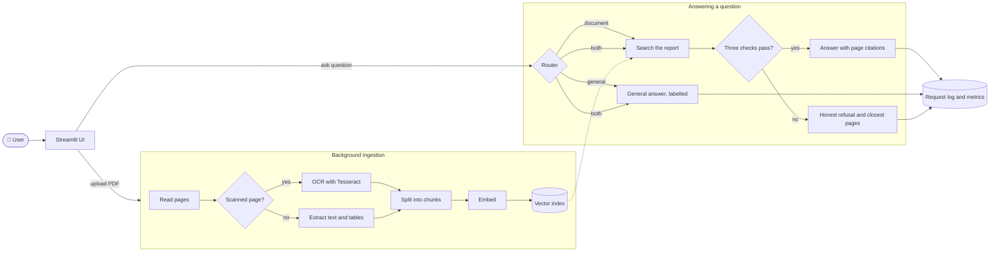

<div align="center">

# 📄 DocQA

### Ask questions about long financial reports, and get answers you can trust.

Upload an annual report. Ask anything. Get a cited answer, or an honest *"I couldn't find that."*


</div>

---

## 🎯 What we are building

Analysts spend hours searching 300-page annual reports for one number. Chatbots answer faster, but they guess, and a confident wrong figure is worse than no answer at all.

**DocQA is a question-answering system for company annual reports that only answers from the report itself, shows exactly which page every answer came from, and says so when the report does not contain the answer.**

> **Business objective:** give an analyst a trustworthy, cited answer from a long financial report in seconds, and make it obvious when the report does not say.

### What it does

| You ask… | DocQA… |
|---|---|
| 📄 **About your document**<br>*"What was standalone revenue in FY2025?"* | Finds the right passages, answers **only from them**, and cites the page. You can open each citation to read the exact snippet. |
| 🌐 **A general question**<br>*"What is working capital?"* | Answers from the model's own knowledge, with a clear label: *"General knowledge, not from your documents."* |
| 🔀 **Both at once**<br>*"What was FY25 revenue, and what is EBITDA?"* | Splits the question and gives **two separate answers**: one from the document, one from general knowledge. |
| ❓ **Something the report doesn't say**<br>*"What is the FY2030 revenue forecast?"* | **Refuses to guess.** It says it couldn't find it and points you to the closest pages. |

### What makes it different

- 🛡️ **Abstain first.** Three independent checks must pass before a document answer is shown. Otherwise the system declines.
- 🔢 **Numbers are verified.** Every figure in an answer must appear in the cited text, or the answer is flagged with a warning.
- 🧾 **Scanned PDFs and tables work.** Scanned pages are read with OCR, and financial tables are kept as tables.
- ⏱️ **No waiting.** Big reports process in the background and can be searched before they finish.
- 📏 **Everything is measured.** A labelled set of 117 questions, a regression gate in CI, and a live metrics dashboard.

### Scope

| ✅ In scope | ❌ Out of scope (on purpose) |
|---|---|
| English annual reports as **PDF**, text or scanned, tables included | Word, Excel, PowerPoint and image files |
| Single-turn questions | Chat memory and follow-up questions |
| Answers with page citations, or an honest refusal | Multiple users and logins |
| Background processing with live progress | Web search for general questions |
| Metrics dashboard and evaluation | Agents, LangChain, LlamaIndex, fine-tuning |

---

## 🧭 How it works

There are two paths. **Uploads** go to a background worker that reads, splits and indexes the PDF. **Questions** go through a router that decides whether the documents are needed, then through the right answer path.



### A question, step by step

1. **Route.** A small, fast model reads the question and the list of uploaded documents and decides: *document*, *general* or *both*. For "both", it splits the question in two. If the router fails, the question is treated as a document question, so the worst case is a refusal, never an invented fact.
2. **Search.** The question is matched against the report using two methods at once: meaning-based search and keyword search. Their rankings are merged and the best five passages are kept.
3. **Check 1, is anything relevant?** If even the best passage is a weak match, the system declines right away, without spending an LLM call.
4. **Check 2, does the model find the answer?** The large model sees only those five passages and is told to answer from them alone. A different year or a different company does not count. If the answer isn't there, the model must say *insufficient*.
5. **Check 3, are the citations real?** The model cites passages by ID, never by page number. We map each ID back to the page ourselves and drop any ID we never sent.
6. **Number check.** Every figure in the answer is looked up in the cited text, with ₹, %, crore and million all handled. A figure that isn't there gets a visible ⚠️ warning.
7. **Log.** Each question writes one row to the request log: route, timings, tokens, cost and outcome, but never the question text itself.

### What the user sees

| Situation | Response |
|---|---|
| Enough evidence | The answer, citations like *Report.pdf · p.47*, and expandable snippets |
| Not enough evidence | *"I couldn't find this in your documents. I won't guess."* plus the closest pages and a tip to be more specific |
| Document still processing | Which pages have been searched so far, and how many are left |
| No document uploaded | A general answer with its label and a note to upload a PDF |
| The LLM service is down | *"The answer service is temporarily unavailable"* plus the most relevant passages found |

### Models

| Job | Model | Runs on |
|---|---|---|
| Writing answers | gpt-oss-120b (open weights) | Groq API, free tier |
| Routing questions | gpt-oss-20b (open weights) | Groq API, separate free quota |
| Embeddings for search | bge-small-en-v1.5 | Locally, on CPU |
| Grading answers (evaluation only) | Gemini 2.5 Flash, a different model family on purpose | Google AI Studio |
| Backup if Groq is down | gpt-oss 20b or Llama 3.2 3b | Locally, through Ollama (optional) |

### Tech stack

| Layer | Choice |
|---|---|
| API | FastAPI |
| UI | Streamlit |
| PDF reading and tables | PyMuPDF |
| OCR | Tesseract |
| Vector index | Chroma |
| Keyword search | Our own BM25, about 60 lines |
| Database | SQLite |
| Background work | One worker thread with a queue, no Redis or Celery |
| LLM access | OpenAI-compatible client, so Groq, Ollama and Gemini all use the same code |
| Tracing (optional) | Langfuse |
| Experiment tracking | MLflow |
| Packaging and CI | Docker Compose, GitHub Actions |

---

## 📊 Progress so far

The build is split into 13 steps, each with its own prompt in the build-prompts folder. **10 of 13 are done.**

| | Step | What it delivered |
|:---:|---|---|
| ✅ | 00 · Skeleton | Project layout, config, Docker, database, logging, CI |
| ✅ | 01 · Eval tooling | The format and validator for labelled test questions |
| ✅ | 02 · Reading PDFs | Page text, OCR for scanned pages, table extraction, chunking |
| ✅ | 03 · Ingestion | Upload endpoint, background worker, embeddings, live status |
| ✅ | 04 · Search | Retrieval, retrieval metrics, MLflow, CI regression gate |
| ✅ | 05 · Grounded answers | Citations, the three checks, the number check |
| ✅ | 06 · Router | Document / general / mixed routing and the main question endpoint |
| ✅ | 07 · UI | Upload with live progress, chat, citation snippets, 👍 / 👎 |
| ✅ | 08 · Metrics | Request log and a dashboard covering speed, inputs, outputs, quality and drift |
| 🟡 | 09 · Full evaluation | **Tools built.** 21 of 117 questions answered so far, because of free-tier limits |
| ⬜ | 10 · Experiments | Not started. Tunes chunk size, search mix, top-k and the refusal threshold |
| ✅ | 11 · Tracing, load test, fallback | Langfuse traces, load test, automatic switch to a local model |
| 🟡 | 12 · README, seed script, demo | **This README is done.** The seed script, demo guide and final numbers are still to do |

### Still open

- **Finish the answer run** for the remaining ~96 questions, a few each day within the free token limit.
- **Check the grader** against two people, who each hand-label 20 answers.
- **Add a real scanned report** to test OCR end to end and to use in the live demo.
- **Run the experiments** and fix the final settings.
- **Try the Ollama backup** on a real machine before the demo.

---

## 📈 Results so far

> Only measured numbers are shown. Anything not yet measured is listed under *Pending*.

### 🔀 Routing: which path a question takes (117 questions)

| Method | Overall accuracy | Mixed questions handled |
|---|:---:|:---:|
| Keyword rules | 95.7% | 11 / 15 |
| Retrieval-score threshold | 84.6% | 0 / 15 |
| **LLM router (ours)** | **99.2%** | **15 / 15** |

Simple rules already handle most plain questions. The LLM router earns its place on **mixed** questions, which have to be split in two, something rules cannot do.

### 🔎 Search: is the answer in what the model sees?

The first version scored well on a page-level metric (77.8% of questions had the right page in the top 5) but hid a real problem: **the actual figure was in the model's context for only 1 of 69 table questions.** Table numbers had been separated from their titles. Adding each table's title to every table chunk, and combining keyword search with meaning-based search, fixed it:

| Search method (69 table questions) | Right page in top 5 | Exact figure in top 5 |
|---|:---:|:---:|
| Meaning-based only (before) | 55 | 1 |
| Keyword only | 69 | 55 |
| **Combined (adopted)** | **68** | **52** |

*Caveat: the test questions reuse the report's own wording, which favours keyword search. Paraphrased questions are next.*

### ✍️ Answers (first 21 questions, after the fix)

| Correct | Wrong numbers | Cited the right page | Tokens per question |
|:---:|:---:|:---:|:---:|
| **19 / 21** | **0** | **19 / 19 answered** | ~3,500 |

Both misses are cautious refusals, not wrong answers.

### ⚙️ Processing speed

| | Text PDF (86 pages) | Scanned PDF (20 pages) |
|---|:---:|:---:|
| Seconds per page | **1.5** | **4.4** |
| A 300-page report | about 7 min | about 22 min |

That is why documents become searchable while they are still processing. **Text pages are indexed first and scanned pages last**, so one slow OCR page never holds back the readable pages after it (a balance sheet on page 78 is searchable in the first sweep). OCR reads plain text well (91–99% word match) but tables less well (78%).

### 🚦 Load test (real API, real Groq, deliberately small)

| Concurrent users | Median latency | Errors |
|:---:|:---:|:---:|
| 1 | 1.4 s | 0 / 5 |
| 3 | 1.4 s | 1 / 5 |
| 5 | 1.5 s | 1 / 5 |

The code is fast. **The limit is Groq's free tier: 8,000 tokens a minute**, which is about 2–3 document questions a minute. The failures were Groq asking us to wait 12–13 seconds. The automatic Ollama backup exists for exactly this.

### 💰 Latency and cost per question

| Measure | Value | Where it comes from |
|---|:---:|---|
| p50 latency | **1.38 s** | load test, 1 user |
| p95 latency | **2.99 s** | load test, 1 user |
| Throughput before Groq's cap | **2–3 document questions / min** | load test (8K tokens / min on the free tier) |
| Tokens per question | **3,406** | metrics page, 6 live questions |
| Cost per question (paid Groq prices) | **$0.00048** | metrics page, 6 live questions |

On the free tier the cost is $0; the figure above is what the same tokens would cost on paid Groq. The first question after a start is slower (the embedding model loads), which is why the metrics page's own p95 over only 6 questions read 30.6 s.

### ⏳ Pending

Answer accuracy across all 117 questions · refusal precision and recall · p99 latency (needs more requests) · grader-versus-human agreement · speed on a real scanned report · a longer load test · the final settings from the experiments.

---

## 🚀 Getting started

### Option 1: Docker (recommended)

```bash
cp .env.example .env          # add your GROQ_API_KEY
docker compose up -d --build
```

| Open | Address |
|---|---|
| The app | http://localhost:8501 |
| The API and its interactive docs | http://localhost:8000/docs |

### Option 2: Run locally

```bash
python -m venv .venv
source .venv/bin/activate                 # Windows PowerShell: .venv\Scripts\Activate.ps1
pip install -r requirements-dev.txt

export GROQ_API_KEY=your-key              # Windows PowerShell: $env:GROQ_API_KEY="your-key"
python -m uvicorn app.main:app --port 8000

# in a second terminal
streamlit run ui/app.py
```

> OCR for scanned pages needs **Tesseract** installed. It is already in the Docker image. Text-only PDFs work without it.

### Try it in 2 minutes

1. Upload a PDF from the sidebar and watch it go from *Queued* to *Processing* to *Ready*.
2. Ask a question about it, then click a citation to see the source snippet.
3. Ask *"What is working capital?"* and notice the *General knowledge* label.
4. Ask for something the report can't contain and watch it decline.
5. Open the **Metrics** page.

### Run the tests

```bash
python -m pytest -q     # 699 tests, about 1 minute; all LLM calls are mocked
ruff check .
```

---

## ⚙️ Configuration

All tuning settings live in one commented file, `config.yaml`. Secrets live only in environment variables.

### Environment variables

| Variable | What it is for | Required? |
|---|---|:---:|
| `GROQ_API_KEY` | Answers and routing | ✅ |
| `GEMINI_API_KEY` | The grader, for evaluation only | — |
| `LLM_BACKEND` | `groq` (default) or `ollama` | — |
| `OLLAMA_BASE_URL` | Setting it turns on the automatic backup | — |
| `LANGFUSE_PUBLIC_KEY`, `LANGFUSE_SECRET_KEY`, `LANGFUSE_BASE_URL` | Tracing, on only when the keys are set | — |
| `DOCQA_LLM_CACHE` | `1` caches LLM replies during development | — |
| `DOCQA_DEBUG` | `1` turns on debug endpoints | — |
| `DOCQA_API_URL` | Where the UI finds the API | — |

> 🔒 `.env` is git-ignored. Docker Compose and the evaluation tools read it. The API started by hand does **not**, so export the variables yourself.

### Settings you'll most likely change

| Setting in `config.yaml` | Default | Meaning |
|---|:---:|---|
| `retrieval.top_k` | 5 | Passages the model sees |
| `retrieval.theta` | 0.5 | Minimum match score before the model is asked (placeholder until step 10) |
| `retrieval.mode` | `hybrid` | `hybrid`, `dense` or `bm25` |
| `chunking.size_tokens` | 400 | Chunk size, with 60 tokens of overlap |
| `ingestion.upsert_every_pages` | 20 | How often progress is saved; use 3–5 for a small demo PDF |
| `observability.log_content` | `false` | Keep question and answer text for the online grader |
| `tracing.capture_content` | `false` | Send question and answer text to Langfuse |

---

## 🗂️ Project structure

```
docqa/
├── app/                    # FastAPI backend
│   ├── main.py             #   app startup and wiring
│   ├── config.py           #   typed settings
│   ├── api/                #   endpoints: documents, query, feedback, debug
│   ├── ingestion/          #   PDF reading, OCR, tables, chunking, embeddings, worker
│   ├── retrieval/          #   hybrid search (meaning + keyword)
│   ├── routing/            #   document / general / mixed router
│   ├── answering/          #   grounded answers, the three checks, number check
│   ├── llm/                #   one client for Groq, Ollama and Gemini, plus retries and backup
│   ├── observability/      #   request log, metrics maths, Langfuse tracing
│   └── storage/            #   SQLite tables
├── ui/                     # Streamlit app: Ask page, Metrics page
├── prompts/                # versioned prompts (router, answers, grader)
├── eval/                   # 117 labelled questions, evaluation runner, grader
├── scripts/                # load test, re-index, online grading, benchmarks
├── tests/                  # 699 tests
├── docs/                   # design, decisions, build log, build prompts
├── config.yaml             # all tunable settings
└── docker-compose.yml
```

### HTTP API

| Method | Endpoint | Purpose |
|---|---|---|
| `GET` | `/health` | Is the service up? |
| `POST` | `/documents` | Upload a PDF. Returns 202 and starts processing |
| `GET` | `/documents` | List documents with status and progress |
| `GET` | `/documents/{id}` | One document's details |
| `DELETE` | `/documents/{id}` | Remove a document and its index entries |
| `POST` | `/query` | Ask a question, up to 500 characters |
| `POST` | `/feedback` | 👍 or 👎 on an answer |

---

## 🧪 Evaluation

A labelled set of **117 questions** about the EIG FY25 annual report drives every number above.

| Question type | Count | What it tests |
|---|:---:|---|
| Answerable document questions | 72 | 69 table figures and 3 narrative facts |
| Near-miss questions the report can't answer | 12 | Does it refuse instead of guessing? |
| General questions | 18 | Including traps such as *"What is working capital?"* |
| Mixed questions | 15 | Can it split and answer both parts? |

**What gets measured:** routing accuracy, search recall, answer correctness (exact number match for figures, an LLM grader for the rest), citation accuracy, refusal precision and recall, number-check failures, latency, tokens and cost. Everything is reported per question type.

**Built for free-tier limits:** runs resume where they stopped, pace themselves to the token budget, and refuse to mix results from different settings.

<details>
<summary><b>Evaluation commands</b></summary>

```bash
python -m eval.validate --strict                              # check the question file
python -m eval.retrieval_eval                                 # search metrics on the indexed report
python -m eval.retrieval_eval --fixture --check               # the CI gate (no report needed)
python -m eval.run --router-only --no-llm-judge --run main     # routing benchmark only
python -m eval.run --run fix1 --slice table --limit 10        # answer 10 more questions
python -m eval.run --run fix1 --report-only --markdown        # rebuild the report
python -m eval.calibrate export --n 20                        # sheet for two people to label
python -m eval.calibrate score                                # agreement with the grader
python scripts/load_test.py                                   # small load test
```

</details>

---

## ⚖️ Design decisions

| We chose… | over… | because… |
|---|---|---|
| An LLM router | keyword rules | only an LLM can split a mixed question (15/15 vs 11/15) |
| Refusing when unsure | always answering | a cited wrong figure destroys trust faster than *"I couldn't find it"* |
| Combined search | meaning-based search alone | the exact figure reached the model 52 times instead of once in 69 |
| Three separate checks | a single score threshold | on this report, answerable and unanswerable questions score almost the same, so a threshold alone can't tell them apart |
| Open models on a free API | running models locally | laptops take 10–40 s per answer; the backup still works offline |
| One thread and SQLite | Celery and Redis | one user and a few documents don't need more infrastructure |
| Plain Python | LangChain or LlamaIndex | every step must be easy to debug and explain |

## ⚠️ Known limitations

- Scanned **tables** are read less accurately than text, and scanned reports are slow to process.
- Only single questions, no follow-ups. One user. English only.
- General answers can be out of date, because there is no web search.
- The test set covers **one report**, and many questions point to the same few pages.

## 💥 What breaks first at 10× traffic

1. **Groq rate limits**: already reached at 3 concurrent users on the free tier.
2. **The single ingestion thread**: uploads queue behind each other.
3. **SQLite and in-memory state**: this setup assumes one API process.
4. **The local vector index**: it won't keep up as documents grow.

---

## 👥 For the team

<details open>
<summary><b>How we work</b></summary>

- **Vinay** implements end to end, and **Purab** helps.
- Each build step has a prompt. Before starting one, read the build-prompts guide and the latest entries in the build log.
- Every step ends by adding an entry to the build log: what was built, how to run it, what changed from the design, and what's still open.
- Commit straight to the main branch once the tests pass and lint is clean. CI checks both, plus the search regression gate.
- Settings belong in the config file, prompts in the prompts folder, and secrets in environment variables only.

</details>

<details open>
<summary><b>⚠️ Gotchas: read these before you run anything</b></summary>

| Gotcha | What to do |
|---|---|
| The Docker app and the evaluation tools share the same data folder | **Stop Docker** before running evaluations or re-indexing |
| Groq's free tier allows 8K tokens a minute and about 200K a day | Use the dev cache and run evaluations in small batches |
| The Gemini grader allows about 20 calls a day | Evaluation runs cap the grader at 10 calls each |
| The API ignores `.env` when started by hand | Export the variables, or use Docker |
| Changing the embedding model | The API refuses to start until you re-index. This is intentional |
| Changing how PDFs are parsed or chunked | Bump the ingest version, stop the API, run the re-index script, and use a new run name |
| The report PDFs are not in git | Keep them locally; the eval docs file maps names to files |

</details>

<details open>
<summary><b>🗺️ Next steps, in order</b></summary>

1. **Finish the answer run**: a few questions a day, then the general and mixed ones.
2. **Experiments (step 10)**: chunk size, search mix on paraphrased questions, top-k, and the refusal threshold. Then lock the final settings.
3. **Calibrate the grader**: two people each label 20 answers, and we fix the grader if agreement is below 80%.
4. **Scanned report**: measure real OCR speed and table accuracy.
5. **Finish step 12**: the seed script that pre-loads reports, the demo guide, and the final numbers in this README.
6. **Rehearse the backup**: pull an Ollama model and run the full demo once offline.

</details>

<details>
<summary><b>🎬 Demo plan (15 minutes)</b></summary>

| Time | Segment |
|---|---|
| 0:00–2:00 | The problem and the business goal |
| 2:00–4:30 | Architecture and three key decisions |
| 4:30–9:30 | **Live demo:** upload a small PDF → ask a general question while it processes → a document question with a citation → a mixed question → a refusal → the Metrics page |
| 9:30–12:30 | Evaluation and LLMOps: results, routing benchmark, CI gate, a Langfuse trace |
| 12:30–14:30 | Trade-offs and what breaks at 10× |
| 14:30–15:00 | Limitations and next steps |

**Safety nets:** reports are pre-loaded, Ollama can take over from Groq, and a screen recording is the last resort.

</details>

---

## 📚 Documentation

| Document | What's inside |
|---|---|
| [`docs/design.md`](docs/design.md) | The full design: requirements, architecture, evaluation plan, risks |
| [`docs/addendum.md`](docs/addendum.md) | Decisions locked later. **Wins over the design** where they differ |
| [`docs/progress.md`](docs/progress.md) | The build log: what was built at each step, measurements, deviations |
| [`docs/optional-features.md`](docs/optional-features.md) | Turning on Langfuse, the Ollama backup and the load test |
| [`docs/build-prompts/`](docs/build-prompts/README.md) | The step-by-step build prompts |
| [`eval/README.md`](eval/README.md) | How to write and verify evaluation questions |

<div align="center">
<sub>Built for the LLMOps course project · Scaler School of Technology</sub>
</div>
